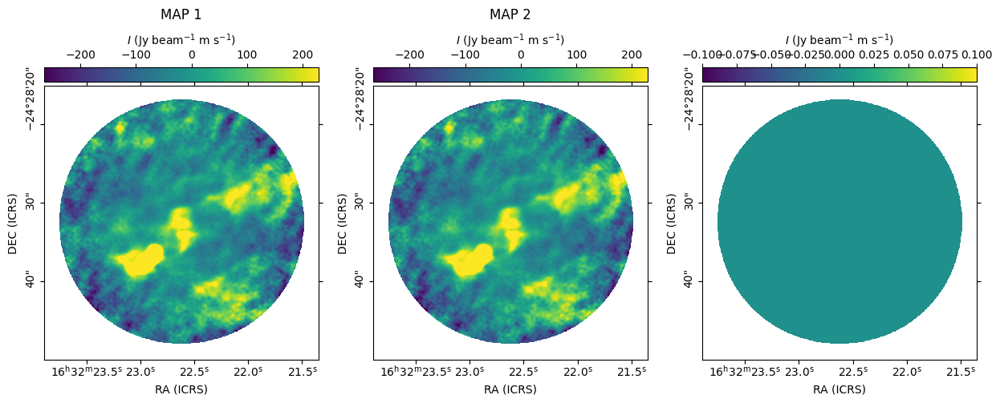

Quick plotters
==============

The `madcubapy.visualization` package also offers various functions to quickly
perform some tasks that do not need to be saved. The functions described in this
page work on `~madcubapy.io.MadcubaMap` and `~astropy.nddata.CCDData` objects.

Quickly plot a map
------------------

To quickly show the contents of a `~madcubapy.io.MadcubaMap` or
`~astropy.nddata.CCDData` object in a pop-up window, we can use the
:func:`~madcubapy.visualization.quick_show` function on the object.

    >>> quick_show(madcuba_map)

This function accepts additional parameters that are passed to
:func:`matplotlib.pyplot.imshow`.

    >>> quick_show(madcuba_map, cmap='jet', norm='log')

Compare two maps
----------------

We can compare if two map objects are equal with the
:func:`~madcubapy.visualization.are_equal` function. This function returns a
boolean value indicating if they are equal or not.

This function can also plot the maps, and show the residuals of their
substraction if ``show_maps`` is set to ``True``:

    >>> are_equal(madcuba_map, madcuba_map.ccddata, show_maps=True)
    Checking if the two maps are equal
    True

Here we see that the `~astropy.nddata.CCDData` inside the ``ccddata`` attribute
of a `~madcubapy.io.MadcubaMap` contains the same information.
