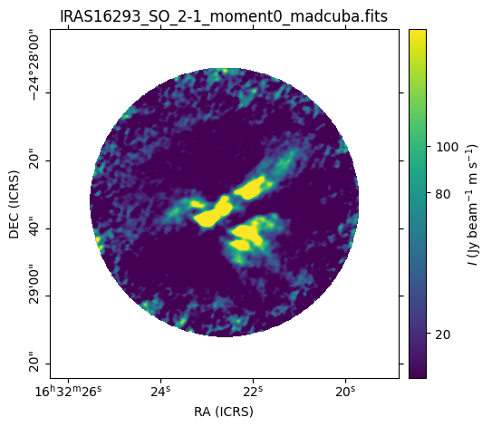

.. _wcsaxes_helpers:

######################################
Plotting images with world coordinates
######################################

The :func:`~madcubapy.visualization.add_wcs_axes` an
:func:`~madcubapy.visualization.add_manual_wcs_axes` functions of `madcubapy`
streamline the process of plotting FITS images through the
`~astropy.visualization.wcsaxes.WCSAxes` interface. Both functions accept
`~madcubapy.io.MadcubaMap` and `~astropy.nddata.CCDData` objects, and will parse
information from the FITS headers to automatically set axes and colorbar labels.

To add a colorbar to a map, `madcubapy` offers the
:func:`~madcubapy.visualization.add_colorbar` and
:func:`~madcubapy.visualization.insert_colorbar` functions. These functions are
also explained :ref:`below <colorbar>`.

Using :func:`~madcubapy.visualization.add_wcs_axes`
===================================================

This function adds an axis using the projection stored in the ``wcs`` attribute
of the map object, returning an `~astropy.visualization.wcsaxes.WCSAxes`
object and `~matplotlib.image.AxesImage`.

To use this function, we first need to create an empty figure, and pass it as
an argument alongside the `~madcubapy.io.MadcubaMap` or
`~astropy.nddata.CCDData` object to plot. The function also accepts additional
arguments that are passed to :func:`~matplotlib.pyplot.imshow` such as *cmap*,
*vmin*, *vmax*, *norm*, and many others.

Under the hood, this function behaves the same way as Matplotlib's
:meth:`~matplotlib.figure.Figure.add_subplot`. After the ``figure`` it accepts
three integer values:``nrows``, ``ncols``, and ``index``. The subplot will take
the *index* position on a grid with *nrows* rows and *ncols* columns, with
*index* starting at 1 in the upper left corner and increases to the right.

By default, these numbers are each of them 1, this way, if we do not provide
them, the function adds a `~astropy.visualization.wcsaxes.WCSAxes` object
occupying the entire figure size.

.. note::
    If we call this function using the argument names explicitly, there is no
    need to pass every function argument.
    However, if we are using positional arguments, every parameter must be added
    in order
    (i.e ``add_wcs_axes(fig_object, nrows, ncols, index, map_object)``)
    
    These following statements are all equivalent:

    * ``add_wcs_axes(fig=fig_object, nrows=1, ncols=1, index=1, fitsmap=map_object)``
    * ``add_wcs_axes(fig_object, 1, 1, 1, map_object)``  
    * ``add_wcs_axes(fig=fig_object, fitsmap=map_object)``

Examples
--------
The following code shows how quickly a map can be plotted using `madcubapy`:

.. code-block:: python

    from madcubapy.io import MadcubaMap
    from madcubapy.visualization import add_wcs_axes

    # Read file
    example_file = "examples/data/IRAS16293_SO_2-1_moment0_madcuba.fits"
    madcuba_map = MadcubaMap.read(example_file)

    # Create empty figure
    fig = plt.figure(figsize=(5,5))

    # Add the WCS axes object to the figure. # We can pass kwargs to imshow(),
    # like 'vmin' and 'vmax'.
    ax, img = add_wcs_axes(fig, fitsmap=madcuba_map, vmin=0, vmax=300)

    plt.show()

.. figure:: ../_static/figures/add_wcs_axes_1.png
   :figclass: align-center

The next code generates a figure with two maps aligned horizontaly. Notice that
the *nrows* and *ncols* parameters are 1 and 2, respectively. This way we have
one row and two columns of images. The third number is the **index** value,
going in order left to right. Here the map on the right (number 2) is using
a logarithmic normalization:

.. code-block:: python

    from madcubapy.io import MadcubaMap
    from madcubapy.visualization import add_wcs_axes

    # Read file
    example_file = "examples/data/IRAS16293_SO_2-1_moment0_madcuba.fits"
    madcuba_map = MadcubaMap.read(example_file)

    # Create empty figure
    fig = plt.figure(figsize=(10,5))

    # Add as many WCS axes objects as desired. We can pass kwargs to imshow()
    ax1, img1 = add_wcs_axes(fig, 1, 2, 1, fitsmap=madcuba_map, vmin=0, vmax=100)
    ax2, img2 = add_wcs_axes(fig, 1, 2, 2, fitsmap=madcuba_map, cmap='jet',
                             vmin=1, vmax=500, norm='log')

    plt.show()

Using :func:`~madcubapy.visualization.add_manual_wcs_axes`
==========================================================

This is a manual version of the :func:`~madcubapy.visualization.add_wcs_axes`
function. It offers the same functionality with one exception: the
`~astropy.visualization.wcsaxes.WCSAxes` object is placed in a manually
selected position instead of a grid.
The location of the subplot is selected via the figure coordinates of its
lower-left corner, alongside its width and height: ``left``, ``bottom``,
``width``, ``height``. Their default values are 0, 0, 1, and 1, respectivelly.

Examples
--------

The previous figure can be recreated using
:func:`~madcubapy.visualization.add_manual_wcs_axes` by placing the left subplot
at the left=0, bottom=0 location with a width of ~half the figure (0.4); and the
right subplot at the left=0.5, bottom=0 location with the same width as before.
Note that the widths are less than half of the figure, and 0.05 has been added
to the ``bottom`` and ``left`` location arguments. This is done to have
sufficient space in the figure to draw the axes ticks and labels, and not have
them cut by the borders.
Also note that the height of the subplots is 1 because the figure size is
already set as 10x5, if we use ~half of the figure height, we would be using
only a height of 2.5 of those 5 available.

.. code-block:: python

    from madcubapy.io import MadcubaMap
    from madcubapy.visualization import add_manual_wcs_axes

    # Read file
    example_file = "examples/data/IRAS16293_SO_2-1_moment0_madcuba.fits"
    madcuba_map = MadcubaMap.read(example_file)

    # Create empty figure
    fig = plt.figure(figsize=(10,5))

    # Add as many WCS axes objects as desired. We can pass kwargs to imshow()
    ax1, img1 = add_manual_wcs_axes(fig, 0.05, 0.05, 0.4, 1, fitsmap=madcuba_map,
                                    vmin=0, vmax=100)
    ax2, img2 = add_manual_wcs_axes(fig, 0.55, 0.05, 0.4, 1, fitsmap=madcuba_map,
                                    cmap='jet', vmin=1, vmax=500, norm='log')

    plt.show()

This function allows for all sorts of placings:

.. code-block:: python

    from madcubapy.io import MadcubaMap
    from madcubapy.visualization import add_manual_wcs_axes

    # Read file
    example_file = "examples/data/IRAS16293_SO_2-1_moment0_madcuba.fits"
    madcuba_map = MadcubaMap.read(example_file)

    # Create empty figure
    fig = plt.figure(figsize=(7,7))

    # Add as many WCS axes objects as desired. We can pass kwargs to imshow()
    ax1, img1 = add_manual_wcs_axes(fig, 0.05, 0.55, 0.2, 0.2, fitsmap=madcuba_map,
                                    vmin=0, vmax=100)
    ax2, img2 = add_manual_wcs_axes(fig, 0.3, 0.05, 0.5, 0.5, fitsmap=madcuba_map,
                                    vmin=0, vmax=100)
    ax3, img3 = add_manual_wcs_axes(fig, 0.6, 0.65, 0.3, 0.3, fitsmap=madcuba_map,
                                    vmin=0, vmax=100)

    plt.show()

.. figure:: ../_static/figures/add_manual_wcs_axes_2.png
   :figclass: align-center

This is specially useful for sticking two maps right next to the other, by
having one start right where the other ends. Note that we need to hide some axis
labels to prevent overplotting text.

.. code-block:: python

    from madcubapy.io import MadcubaMap
    from madcubapy.visualization import add_manual_wcs_axes

    # Read file
    example_file = "examples/data/IRAS16293_SO_2-1_moment0_madcuba.fits"
    madcuba_map = MadcubaMap.read(example_file)

    # Create empty figure
    fig = plt.figure(figsize=(10,5))

    # Add as many WCS axes objects as desired. We can pass kwargs to imshow()
    ax1, img1 = add_manual_wcs_axes(fig, 0.05, 0.05, 0.4, 1, fitsmap=madcuba_map,
                                    vmin=0, vmax=100)
    ax2, img2 = add_manual_wcs_axes(fig, 0.45, 0.05, 0.4, 1, fitsmap=madcuba_map,
                                    vmin=0, vmax=100)

    # Disable axis label and ticklabels for the right subplot
    ax2.coords[1].set_ticklabel_visible(False)
    ax2.coords[1].set_axislabel(" ", visible=False)

    plt.show()

.. figure:: ../_static/figures/add_manual_wcs_axes_3.png
   :figclass: align-center

.. _colorbar:

Add a colorbar to a map
=======================

We can add a colorbar easily to any side of the map by using the
:func:`~madcubapy.visualization.add_colorbar` or
:func:`~madcubapy.visualization.insert_colorbar` functions.

Both functions need the ``ax`` parameter, which must be a
`~astropy.visualization.wcsaxes.WCSAxes` object. The position of the colorbar is
controlled by the ``location`` argument, which can be 'top', 'right', 'bottom',
or 'left' (defaults to 'right'). The functions also accept additional arguments
that are passed to :func:`matplotlib.pyplot.colorbar` to customize the colorbar.
With this we can directly set custom ticks, a custom label, etc.

Usage example:

.. code-block:: python

    from madcubapy.io import MadcubaMap
    from madcubapy.visualization import add_wcs_axes
    from madcubapy.visualization import add_colorbar
    from madcubapy.visualization import insert_colorbar

    example_file = "../../../examples/data/IRAS16293_SO_2-1_moment0_madcuba.fits"
    madcuba_map = MadcubaMap.read(example_file)

    # Plot map
    fig = plt.figure(figsize=(5, 5))
    ax, img = add_wcs_axes(fig, 1, 1, 1, fitsmap=madcuba_map, vmin=1, vmax=150)

    # Add a colorbar passing a custom ticks argument.
    cbar = add_colorbar(ax=ax, ticks=[20, 80, 100]) # Test use ticks kwarg

    plt.show()

Placement of the colorbar
-------------------------

The two functions offer the same functionality but using two different
approaches to place the colorbar in a figure.

- ``insert_colorbar`` adds a colorbar to one side of the
  `~astropy.visualization.wcsaxes.WCSAxes` object, which is resized to
  accomodate the colorbar inside the space it was taking.
  The colorbar axes will always maintain the width that was set in the
  beggining, regardless of a change in the map size later (like resizing the
  window).
- ``add_colorbar`` adds a colorbar at a location relative to the
  `~astropy.visualization.wcsaxes.WCSAxes`.
  This version does not resize the `~astropy.visualization.wcsaxes.WCSAxes`
  and adds the cbar axes right where it is told, overlapping with anything that
  could be there before. The colorbar maintains the relative width relative to
  the map if it changes size later.

The following code shows the difference between
:func:`~madcubapy.visualization.add_colorbar` and
:func:`~madcubapy.visualization.insert_colorbar`:

.. code-block:: python

    from madcubapy.io import MadcubaMap
    from madcubapy.visualization import add_wcs_axes
    from madcubapy.visualization import add_colorbar
    from madcubapy.visualization import insert_colorbar

    example_file = "examples/data/IRAS16293_SO_2-1_moment0_madcuba.fits"
    madcuba_map = MadcubaMap.read(example_file)

    fig = plt.figure(figsize=(15,4))
    ax1, img1 = add_wcs_axes(fig, 1, 3, 1, fitsmap=madcuba_map,
                             use_std=True, cmap='jet')
    ax2, img2 = add_wcs_axes(fig, 1, 3, 2, fitsmap=madcuba_map,
                             use_std=True, cmap='jet')
    ax3, img3 = add_wcs_axes(fig, 1, 3, 3, fitsmap=madcuba_map,
                             use_std=True, cmap='jet')

    # Append a colorbar to the top of the axes
    cbar2 = insert_colorbar(ax=ax2, location='top', label='custom units')
    # Add a colororbar on top of the axces
    cbar3 = add_colorbar(ax=ax3, location='top', label='custom units')

    plt.show()

As we can see, the map in the middle (set with ``insert_colorbar``) has been
resized to accomodate the colorbar on top of it using the same space as the
map on the left, while the map on the right (set with ``add_colorbar``)
places the colorbarbar on new space on top of it without resizing the axes.

Automatic unit parsing
----------------------

By default both functions parse the units from the
`~madcubapy.io.MadcubaMap` or `~astropy.nddata.CCDData` object if found, and
sets the label accordingly.
Due to a limitation in how the functions are coded, only the units of the last
plotted map is correctly tracked. This is intentional to keep the number of
needed arguments as low as possible.

To allow for a correct parsing of the units of every map, the colorbar must
be added to a map before the next one is plotted:

.. code-block:: python

    # This parses the units of both maps correctly
    ax1, img1 = add_wcs_axes(fig, 1, 2, 1, fitsmap=madcuba_map_1)
    cbar1 = add_colorbar(ax1)
    ax2, img2 = add_wcs_axes(fig, 1, 2, 2, fitsmap=madcuba_map_2)
    cbar2 = add_colorbar(ax2)

    # This only recognizes the units of madcuba_map_2
    ax1, img1 = add_wcs_axes(fig, 1, 2, 1, fitsmap=madcuba_map_1)
    ax2, img2 = add_wcs_axes(fig, 1, 2, 2, fitsmap=madcuba_map_2)
    cbar1 = add_colorbar(ax1)
    cbar2 = add_colorbar(ax2)
